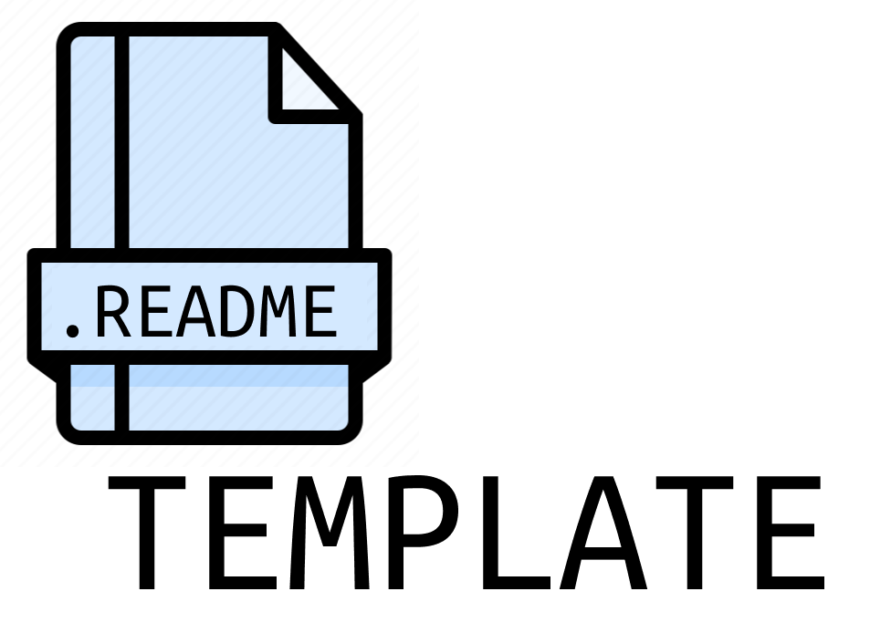

     

<h4 align="center">This is a model README for repositories on Github. </h4>

    
    
    
    

  <a href="#about-the-project">About</a> • 
  <a href="#project-notes">Project notes</a> •
  <a href="#gallery">Gallery</a> •
  <a href="#getting-started">Getting started</a> •
  <a href="#contributing">Contributing</a> •
  <a href="#contacting">Contacting</a> •
  <a href="#license">License</a>

 

## About the Project
Lorem ipsum dolor sit amet, consectetur adipiscing elit. Aenean at lacinia mauris. Donec consequat ligula sapien. Fusce vitae vestibulum diam. Orci varius natoque penatibus et magnis dis parturient montes, nascetur ridiculus mus. Donec suscipit dapibus ligula, non maximus augue tempor a. Etiam sed dolor magna. Praesent rhoncus urna eu ipsum accumsan dignissim.

## Project Notes
- Lorem ipsum dolor sit amet, consectetur adipiscing elit. Aenean at lacinia mauris. Donec consequat ligula sapien. Fusce vitae vestibulum diam.
- Lorem ipsum dolor sit amet, _consectetur adipiscing elit_. Aenean at lacinia mauris. Donec consequat _ligula sapien_. Fusce vitae vestibulum diam.
- Lorem ipsum dolor sit amet, consectetur adipiscing elit.

## Gallery

### Lorem ipsum dolor sit amet, consectetur adipiscing elit.

 

### Lorem ipsum dolor sit amet, consectetur adipiscing elit.

 

# Getting Started?
Lorem ipsum dolor sit amet, consectetur adipiscing elit. Aenean at lacinia mauris. Donec consequat ligula sapien. Fusce vitae vestibulum diam. 
~~~bash
# Lorem ipsum dolor sit amet
$ git clone git@github.com:yagopeixinho/readmeTemplate.git
~~~

# Contributing

Feel free to send as many _pull-request_ as you wish and I will gladly review it!

# Contacting

- 📬 Send me an e-mail: peixinhoyago@gmail.com
- If you have any questions or want to contact me for any other reason, you can find my social networks and more information about me [by clicking here](https://github.com/yagopeixinho/yagopeixinho/blob/master/README.md)

## License

This project is licensed under the MIT License. [Click here for more details](https://github.com/yagopeixinho/vouAoMercado/blob/master/LICENSE)
